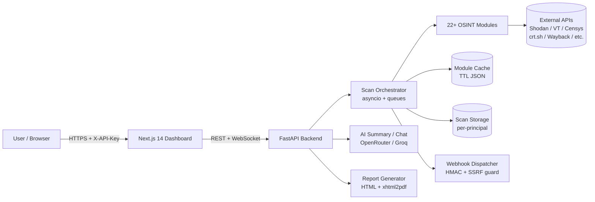

<div align="center">

# PRISM — Open Source Intelligence Platform

**Self-hosted OSINT platform with 22+ modules, OPSEC scoring, AI summary, and a real-time web dashboard.**

Scan any domain, IP, email, phone, or username — get WHOIS, DNS, threat intel, breach data, username search, dark-web mirrors, OPSEC score, entity graphs, and HTML/PDF reports in seconds.

**[Live Demo](https://getprism.su)** · **[Docker Quick Start](#docker-recommended)** · **[Architecture](docs/ARCHITECTURE.md)** · **[Security](SECURITY.md)** · **[Changelog](CHANGELOG.md)**

[](https://github.com/NovaCode37/Prism-platform/actions/workflows/ci.yml)
[](CHANGELOG.md)
[](https://getprism.su)
[](LICENSE)
[](#running-tests)
[](https://www.python.org/)
[](https://fastapi.tiangolo.com/)
[](https://nextjs.org/)
[](https://www.typescriptlang.org/)
[](Dockerfile)
[](https://github.com/NovaCode37/Prism-platform/stargazers)
[](https://github.com/NovaCode37/Prism-platform/network/members)

</div>

> If you find PRISM useful, please consider giving it a ⭐ — it helps others discover the project and motivates further development.

<div align="center">

### Table of Contents

[Why PRISM?](#why-prism) • [Overview](#overview) • [Why PRISM vs alternatives?](#why-prism-vs-alternatives) • [Use cases](#use-cases) • [Features](#features) • [Showcase](#showcase) • [Quick Start](#quick-start) • [Configuration](#configuration) • [API](#api) • [Project Structure](#project-structure) • [Running Tests](#running-tests) • [CI/CD](#cicd) • [Roadmap](#roadmap) • [Star History](#star-history) • [Legal Notice](#legal-notice) • [Support the project](#support-the-project) • [Contributing](#contributing) • [License](#license)

</div>

<p align="center">
  
</p>

---

## Why PRISM?

- **22+ modules** — WHOIS, DNS, crt.sh, Wayback Machine, Shodan, VirusTotal, AbuseIPDB, **Censys**, **Dark Web (Ahmia + DarkSearch)**, email reputation, SMTP verify, breach lookup, Blackbird (50+ sites), Maigret (3000+ sites), Telegram, phone HLR, email headers, file metadata, and more
- **AI-powered analysis** — automated executive summary, risk assessment, and interactive Q&A chat via LLM (OpenRouter / Nvidia Nemotron)
- **Real-time dashboard** — WebSocket-driven scan progress with **module-level progress bar (5/8 · 62%)**, interactive entity relationship graph, **multi-marker Leaflet GeoIP map**
- **OPSEC Score** — aggregated 0–100 exposure risk score across data exposure, identity, infrastructure and web security
- **HTML, PDF, CSV & Markdown reports** — export full scan results as HTML, PDF, CSV, or Markdown (locale-aware EN/RU/DE/FR/ES)
- **Multi-language UI** — English, Russian, German, French, Spanish out of the box (i18n + auto-detect)
- **Standalone CLI** — run scans headlessly via `python cli.py scan example.com --json`
- **Scan history & comparison** — browse past scans, load results, compare two scans side-by-side
- **Webhook callbacks** — get notified on scan completion with HMAC-signed payloads (SSRF-protected), Slack/Discord formatters
- **Hardened auth** — header-only API keys (`X-API-Key` / `Bearer`), no query-string secrets, strict CORS, per-principal scan isolation
- **Zero mandatory API keys** — 14 out of 22 modules work without any keys at all
- **One-command deploy** — `docker compose up --build` and you're running
- **Fully open source** — MIT license, extensible module architecture, contributor-friendly

---

## Overview

PRISM aggregates data from **20+ external intelligence sources** to build a comprehensive profile of any target — domain, IP address, email, phone number, or social username. All data is presented in a real-time dashboard with relationship graphs, a GeoIP map, exportable HTML/PDF reports, and an automated OPSEC exposure score.

**Stack:**
- **Backend** — Python 3.10+, FastAPI, asyncio, WebSocket, Pydantic, slowapi (rate limiting), xhtml2pdf (PDF)
- **Frontend** — Next.js 14 (App Router), React, TypeScript, Tailwind CSS, Leaflet (maps)
- **AI** — OpenRouter (Nvidia Nemotron) or Groq (Llama-3) for summary and chat
- **Infrastructure** — Docker, docker-compose, GitHub Actions CI/CD
- **Tests** — pytest, **123 test cases** with monkeypatching, network mocking, SSRF/auth coverage

<p align="center">
  
</p>

### Architecture (high level)



---

## Why PRISM vs alternatives?

| Capability                        | **PRISM**             | SpiderFoot CE | theHarvester | Recon-ng    | Maltego CE |
|-----------------------------------|-----------------------|---------------|--------------|-------------|------------|
| Modern web dashboard              | ✅ Next.js 14         | ⚠️ legacy     | ❌ CLI only  | ❌ CLI only | ✅ desktop |
| Real-time scan progress (WS)      | ✅                    | ❌            | ❌           | ❌          | ❌         |
| AI-powered summary + chat         | ✅ LLM                | ❌            | ❌           | ❌          | ❌         |
| OPSEC score (0–100)               | ✅                    | ❌            | ❌           | ❌          | ❌         |
| Entity graph (interactive)        | ✅                    | ✅            | ❌           | ❌          | ✅         |
| GeoIP map (multi-marker)          | ✅ Leaflet            | ⚠️ basic      | ❌           | ❌          | ⚠️         |
| HTML + PDF report export          | ✅ EN/RU/DE/FR/ES           | ⚠️ HTML       | ❌           | ⚠️          | ⚠️         |
| Multi-language UI                 | ✅ EN/RU/DE/FR/ES           | ❌            | ❌           | ❌          | ❌         |
| Zero-key out of the box           | ✅ 14/22 modules      | ⚠️            | ⚠️           | ⚠️          | ❌         |
| Webhook callbacks (signed)        | ✅                    | ❌            | ❌           | ❌          | ❌         |
| One-command Docker deploy         | ✅                    | ⚠️            | ❌           | ⚠️          | ❌         |
| MIT license                       | ✅                    | ❌ GPLv2      | ✅           | ✅ GPLv3    | ❌         |

---

## Use cases

- **Bug bounty recon** — kick off a single scan and get subdomains (crt.sh + Censys), open ports (Shodan), wayback sensitive paths, and AI-prioritized findings.
- **Phishing investigation** — pivot from a suspicious domain or email to threat intel, breach exposure, mail auth (SPF/DKIM/DMARC), and historical snapshots.
- **Brand & impersonation monitoring** — webhook-driven scans to detect new lookalike subdomains, dark-web mentions, and exposed credentials.
- **Security awareness training** — give employees their own OPSEC score across email, phone, and username so they see exposure on a 0–100 scale.
- **Academic / educational OSINT** — a self-hosted, MIT-licensed reference for teaching passive reconnaissance, geolocation, and threat intel pipelines.

---

## Features

| Module | Description | API Key |
|--------|-------------|----------|
| WHOIS | Domain registration, registrar, dates | — |
| DNS | A, MX, NS, TXT, CNAME, SOA records | — |
| Certificate Transparency | Subdomain discovery via crt.sh | — |
| Wayback Machine | Historical snapshots, sensitive URL patterns | — |
| GeoIP | IP geolocation, ASN, timezone | ipinfo.io |
| Shodan | Open ports, services, known CVEs | Shodan |
| Censys | Host services, ASN, certificate → subdomain discovery | Censys |
| VirusTotal | Domain/IP reputation, malware detections | VirusTotal |
| AbuseIPDB | IP abuse confidence score | AbuseIPDB |
| Dark Web Checker | .onion mirrors via Ahmia + DarkSearch | — |
| Website Analyzer | Tech stack, emails, social links, metadata | — |
| Email Reputation | DNS-based email rep (MX, SPF, DMARC, disposable check) | — |
| SMTP Verify | Mailbox existence check via SMTP handshake | — |
| Breach Check | Email breach / credential leak lookup | Leak-Lookup |
| Blackbird | Username presence across 50+ platforms (async) | — |
| Maigret | Deep username search across 3000+ sites | — |
| Telegram Lookup | Username/ID lookup via Bot API + scraping | Telegram |
| Phone / HLR | Number validation, carrier, country, reverse lookup | Numverify |
| Email Headers | SPF/DKIM/DMARC analysis, routing hops, spoofing detection | — |
| File Metadata | EXIF, GPS coordinates, PDF/DOCX properties | — |
| OPSEC Score | Aggregated 0–100 exposure risk score | — |
| Entity Graph | Interactive node-relationship visualization | — |
| HTML / PDF Report | Self-contained styled report (HTML + xhtml2pdf), localized EN/RU/DE/FR/ES | — |
| AI Summary | Natural-language findings summary via LLM | OpenRouter / Groq |
| Webhook Callbacks | HMAC-signed POST on scan completion (SSRF-guarded) | — |

---

## Showcase

<p align="center">
  
</p>

<p align="center">
  
</p>

<p align="center">
  
</p>

<details>
<summary><b>More screenshots (domain / IP / email / phone / username / standalone tools)</b></summary>

### Domain Scan
WHOIS, DNS, threats, Wayback, GeoIP map, entity graph.

<p align="center"></p>
<p align="center"></p>
<p align="center"></p>
<p align="center"></p>
<p align="center"></p>
<p align="center"></p>
<p align="center"></p>

### IP Scan
VirusTotal + AbuseIPDB threat intel, GeoIP map, entity graph.

<p align="center"></p>
<p align="center"></p>

### Email Scan
DNS-based reputation, SMTP mailbox verification, breach check.

<p align="center"></p>
<p align="center"></p>

### Phone Scan
Number validation, carrier detection, country/region, timezone, reverse lookup.

<p align="center"></p>
<p align="center"></p>

### Username Scan
Blackbird async search across 50+ platforms.

<p align="center"></p>
<p align="center"></p>

### AI Analysis
LLM-powered OSINT summary + interactive chat.

<p align="center"></p>

### Standalone Tools
File Metadata (EXIF/GPS), Email Header Analyzer, Crypto Address Lookup, QR Code Decoder.

<p align="center"></p>
<p align="center"></p>
<p align="center"></p>
<p align="center"></p>

</details>

---

## Quick Start

### Try in 60 seconds (no setup, no API keys)

Spin up a self-contained demo preloaded with example scans — no API keys, no external lookups required:

```bash
git clone https://github.com/NovaCode37/Prism-platform.git
cd Prism-platform
docker compose -f docker-compose.demo.yml up --build
```

Open **http://localhost:8080** — three sample scans (a domain, an IP, and a username) are already under **Recent Scans**, showing the dashboard, OPSEC score, entity graph, map, and HTML/PDF report. Run your own scan from the same screen (free modules like WHOIS/DNS/GeoIP need no key).

> The demo runs anonymously (`ALLOW_ANON_API=true`) and only ships the bundled UI on `:8080`. For the full Next.js frontend, use the Docker / Manual setups below.

### Docker (recommended)

```bash
git clone https://github.com/NovaCode37/Prism-platform.git
cd Prism-platform
cp .env.example .env        # edit and set API_KEYS, optionally provider keys
docker compose up --build
```

Open **http://localhost:3000** (frontend) and **http://localhost:8080** (API).

### Manual

```bash
# 1. Backend
git clone https://github.com/NovaCode37/Prism-platform.git
cd Prism-platform
pip install -r requirements.txt
cp .env.example .env
python -m uvicorn web.app:app --host 0.0.0.0 --port 8080 --reload

# 2. Frontend (in a separate terminal, from repo root)
cd frontend
npm install
# create .env.local with the same key you put into API_KEYS / API_KEY:
#   NEXT_PUBLIC_API_URL=http://localhost:8080
#   NEXT_PUBLIC_API_KEY=<your-api-key>
npm run dev
```

Open **http://localhost:3000**.

> Since v2.2 the backend rejects requests without a valid `X-API-Key` header by default. To run a fully open instance for local experimentation, set `ALLOW_ANON_API=true` in `.env`.

---

## Configuration

PRISM is configured via environment variables (`.env`). All API keys are optional — modules that need a missing key gracefully skip.

### Core auth & networking

| Variable             | Purpose                                                                 |
|----------------------|-------------------------------------------------------------------------|
| `API_KEYS`           | Comma-separated list of accepted API keys (preferred, multi-tenant)     |
| `API_KEY`            | Single API key (legacy, also accepted)                                  |
| `ALLOW_ANON_API`     | `true` to allow unauthenticated API access (off by default)             |
| `ALLOWED_ORIGINS`    | Comma-separated CORS origins; empty/unset = no cross-origin             |
| `MAX_UPLOAD_MB`      | Max upload size for file-based tools (default `20`)                     |
| `MAX_STORED_SCANS`   | In-memory scan cap before disk-only mode (default `200`)                |
| `CACHE_TTL_HOURS`    | Per-module cache TTL (default `24`)                                     |
| `WEBHOOK_SECRET`     | If set, signs webhook callbacks with `X-Prism-Secret`                   |
| `DISABLE_DOCS`       | `true` to disable `/docs`, `/redoc`, `/openapi.json` in production      |

### External provider keys

| Variable                          | Service                              | Free Tier        |
|-----------------------------------|--------------------------------------|------------------|
| `NUMVERIFY_API_KEY`               | Phone validation & carrier           | 100 req/mo       |
| `IPINFO_API_KEY`                  | GeoIP location                       | 50k req/mo       |
| `VIRUSTOTAL_API_KEY`              | Threat intelligence                  | 500 req/day      |
| `ABUSEIPDB_API_KEY`               | IP abuse score                       | 1000 req/day     |
| `SHODAN_API_KEY`                  | Port scan + CVE lookup               | Free tier        |
| `CENSYS_API_ID` + `CENSYS_API_SECRET` | Host & certificate search        | 250 req/mo       |
| `OPENROUTER_API_KEY`              | AI summary (Nvidia Nemotron)         | Free tier        |
| `GROQ_API_KEY`                    | AI fallback (Llama-3 instant)        | Free tier        |
| `TELEGRAM_BOT_TOKEN`              | Telegram user lookup                 | Free             |
| `LEAK_LOOKUP_API_KEY`             | Breach database                      | Limited free     |

### Variables

| Variable             | What it enables                                   | Required? | Where to Get               |
| :--------------------| :------------------------------------------------ | :-------- | :------------------------- |
| `API_KEY`            |  Secures your API endpoints                        | Yes  | Generate your own secure string |
| `API_KEYS`           |  Allows passing multiple comma-separated API keys | No   | Generate your own secure strings|
| `ALLOW_ANON_API`     | Allows unauthenticated API requests without a key | No   | Set to true                     |
| `NUMVERIFY_API_KEY`  | Validates phone numbers                           | No   | Numverify dashboard             |
| `LEAK_LOOKUP_API_KEY`| Searches Data Breaches for Leaked Credentials     | No   | LeakLookup API dashboard        |
| `HIBP_API_KEY`       | Checks if Email/Passwords have been compromised   | No   | HIBP Developer Portal           |
| `IPINFO_API_KEY`     | Fetches geolocation and ASN details for IP addresses| No | IPInfo.io Dashboard             |
| `VIRUSTOTAL_API_KEY` | Scans file hashes and URLs for malware            | No   | VirusTotal API Dashboard        | 
| `ABUSEIPDB_API_KEY`  |Checks if an IP address has been reported for malicious activity | No | AbuseIPDB Dashboard  |
| `SHODAN_API_KEY`     |Searches for internet-connected devices and open ports | No | Shodan Developer Dashboard     |
| `TELEGRAM_BOT_TOKEN` | Sends automated scan alerts and reports directly to a Telegram channel | No | Telegram BotFather |
| `CENSYS_API_ID`      | Authenticates attack surface and internet-wide scanning queries | No | Censys Search Console |
| `CENSYS_API_SECRET`  | Paired with CENSYS_API_ID for Censys data access | No | Censys Search Console |
| `ALLOWED_ORIGINS`    | Configures CORS settings to restrict which frontend domains can talk to your backend | No | Set to a comma-separated list of domains |
| `OPENROUTER_API_KEY` | AI summary & chat via OpenRouter (preferred LLM provider) | No | OpenRouter dashboard|
| `GROQ_API_KEY`       | AI summary & chat via Groq (fallback LLM provider) | No | Groq Console |
| `MAX_STORED_SCANS`   |Max scans kept in memory before old ones are evicted (default 200) | No | Set An Integer Value |
| `DISABLE_DOCS`       | Disables the /docs and /redoc API documentation pages | No | Set to True/False |
| `WEBHOOK_SECRET`     | Adds an X-Prism-Secret header to webhook callbacks for verification | No | Generate a Placeholder string |
| `MAX_UPLOAD_MB`      |Sets the maximum file size limit for uploads, defaults to 20MB if missing.| No| Set an integer value |
| `WEBHOOK_FORMAT`     |Configures the format for webhook data payloads. | No | Set to raw, slack, or discord|
| `CACHE_TTL_HOURS`    |Module cache TTL in hours | No | Set an integer value |

---

> Certificate Transparency, Wayback Machine, DNS, WHOIS, Website Analyzer, Email Reputation, SMTP Verify, Blackbird, Maigret, Email Headers, File Metadata, and **Dark Web Checker** all work **with zero API keys**.

---

## API

The backend exposes a REST + WebSocket API. All requests require an `X-API-Key` (or `Authorization: Bearer`) header unless `ALLOW_ANON_API=true`. Interactive docs are served at **`/docs`** (Swagger) and **`/redoc`** when running locally (unless `DISABLE_DOCS=true`).

| Method | Endpoint | Description |
|--------|----------|-------------|
| `POST` | `/api/scan` | Start a scan (`{ target, scan_type, modules }`) → returns `scan_id` |
| `GET`  | `/api/scan/{id}` | Scan status and results |
| `GET`  | `/api/scan/{id}/graph` | Entity relationship graph |
| `GET`  | `/api/scan/{id}/map` | GeoIP map markers |
| `GET`  | `/api/scan/{id}/report` | HTML report |
| `GET`  | `/api/scan/{id}/report/pdf` | PDF report |
| `GET`  | `/api/scans` | List past scans (per-principal) |
| `WS`   | `/ws/{scan_id}` | Live scan progress stream |
| `POST` | `/api/ai/summary`, `/api/ai/chat` | AI summary and Q&A |
| `POST` | `/api/url-scan`, `/api/mac-lookup`, `/api/darkweb`, `/api/qr-decode`, `/api/email-headers`, `/api/metadata` | Standalone tools |

```bash
curl -X POST http://localhost:8080/api/scan \
  -H "X-API-Key: $API_KEY" -H "Content-Type: application/json" \
  -d '{"target":"example.com","scan_type":"domain"}'
```

---

## Project Structure

```
prism/
├── config.py                     # Environment + API key loader
├── requirements.txt
├── Dockerfile
├── docker-compose.yml
│
├── modules/
│   ├── extra_tools.py            # WHOIS, GeoIP, DNS, Website Analyzer
│   ├── cert_transparency.py      # Subdomain discovery via crt.sh
│   ├── threat_intel.py           # VirusTotal + AbuseIPDB
│   ├── shodan_lookup.py          # Shodan host intelligence
│   ├── censys_lookup.py          # Censys host + certificate search
│   ├── wayback.py                # Wayback Machine snapshots + sensitive URLs
│   ├── onion_checker.py          # .onion mirror checker (Ahmia + DarkSearch)
│   ├── darkweb_search.py         # Dark-web mentions search
│   ├── blackbird.py              # Username search (async, 50+ platforms)
│   ├── maigret_wrapper.py        # Deep username search (3000+ sites)
│   ├── hlr_lookup.py             # Phone validation + reverse lookup
│   ├── hunter.py                 # DNS-based email reputation check
│   ├── smtp_verify.py            # SMTP mailbox existence verification
│   ├── leak_lookup.py            # Email breach / credential leak lookup
│   ├── telegram_lookup.py        # Telegram username/ID lookup
│   ├── email_header_analyzer.py  # SPF/DKIM/DMARC + hop analysis
│   ├── metadata_extractor.py     # EXIF/PDF/DOCX + GPS extraction
│   ├── crypto_lookup.py          # Crypto address heuristics
│   ├── qr_decoder.py             # QR image decoder
│   ├── url_scanner.py            # Standalone URL scanner
│   ├── opsec_score.py            # Exposure risk scoring (0–100)
│   ├── graph_builder.py          # Entity relationship graph data
│   ├── report_generator.py       # Jinja2 HTML report + xhtml2pdf PDF
│   └── report_i18n.py            # Report translations EN / RU / DE
│
├── web/
│   ├── app.py                    # FastAPI + WebSocket scan engine
│   └── security.py               # Auth, CORS, rate limiting, SSRF guard
│
├── frontend/                     # Next.js 14 + TypeScript + Tailwind
│   └── src/
│       ├── app/                  # App Router pages
│       ├── components/           # UI (Topbar, Sidebar, Map, Graph, ...)
│       └── lib/                  # API client, i18n, types
│
└── tests/                        # 123 pytest tests
    ├── test_modules.py
    ├── test_modules_extended.py
    ├── test_v2_1_modules.py
    └── test_webhook.py
```

---

## Running Tests

```bash
pip install pytest pytest-cov pytest-asyncio
pytest -q
# or with coverage:
pytest tests/ -v --cov=modules --cov=web --cov-report=term-missing
```

Frontend type check:

```bash
cd frontend
npx tsc --noEmit -p tsconfig.json
```

---

## CI/CD

GitHub Actions pipeline (`.github/workflows/ci.yml`):

1. **Lint** — flake8
2. **Test** — pytest with coverage
3. **Build** — Docker image

---

## Roadmap

### v2.2 — released
- [x] Multilingual report rendering (EN / RU / DE) via `report_i18n`
- [x] Webhook callbacks with HMAC signing + SSRF guard
- [x] Multi-marker Leaflet GeoIP map (replaces single-iframe map)
- [x] Hardened auth: header-only API keys, no query-string secrets
- [x] Strict CORS by default; `ALLOW_ANON_API` opt-in for anonymous mode
- [x] Phone map: removed coordinate fabrication, only explicit lat/lng
- [x] Authenticated HTML/PDF report download via blob fetch
- [x] Test suite expanded to **102 cases**

### v2.3 — released
- [x] Scan history panel + side-by-side scan comparison (diff view)
- [x] CSV & Markdown report export (alongside HTML/PDF)
- [x] French (FR) & Spanish (ES) locales — UI now ships EN / RU / DE / FR / ES
- [x] Standalone CLI (`python cli.py scan <target> --json|--html|--pdf`)
- [x] Slack / Discord webhook formatters (`WEBHOOK_FORMAT=slack|discord`)
- [x] Rate-limit response headers, keyboard shortcuts, scan duration, copy-all-emails
- [x] Graceful module degradation — `skipped` / `rate_limited` statuses instead of hard errors
- [x] IP / Subnet calculator standalone tool
- [x] One-command demo (`docker compose -f docker-compose.demo.yml up`) with seeded scans
- [x] Reliable Leaflet map rendering + Unicode (Cyrillic) fonts in PDF export

### v2.4 — planned
- [ ] Scheduled scans + diff alerting via webhooks
- [ ] Browser extension for one-click scans
- [ ] Per-API-key quotas and usage stats endpoint
- [ ] GitHub user / organization recon module
- [ ] Entity graph export to GEXF / GraphML (Gephi / Maltego)
- [ ] Additional locales (ZH and community-contributed) + dark/light theme toggle

> Want to contribute? Pick an open issue tagged `good first issue` or open a new one.

---

## Star History

<a href="https://star-history.com/#NovaCode37/Prism-platform&Date">
  <picture>
    <source media="(prefers-color-scheme: dark)" srcset="https://api.star-history.com/svg?repos=NovaCode37/Prism-platform&type=Date&theme=dark" />
    <source media="(prefers-color-scheme: light)" srcset="https://api.star-history.com/svg?repos=NovaCode37/Prism-platform&type=Date" />
    
  </picture>
</a>

---

## Legal Notice

This tool is intended **exclusively for lawful use**:
- Authorized security assessments and penetration testing
- Research on infrastructure you own or have explicit permission to test
- Academic and educational purposes

Do **not** use PRISM for unauthorized data collection, surveillance, or any activity that violates applicable law. The author assumes no liability for misuse.

---

## Support the project

If PRISM is useful to you, a ⭐ is the best free way to help. If you'd like to support development financially:

- **[SberTips](https://pay.mysbertips.ru/80561611)** (RUB)
- **Crypto:**

```
USDT (TRC20): TEdN41cTdAyNm7vrP4NYceT9sVhTB9BHho
TON:          UQAkpcYb0hKgqEwGLs08syU_4Nh-_MhwaJT3HPWqFSidLThV
BTC:          bc1qm8zvvh2ehv3m2su6u0exmcr903cf07gn0r66y6
ETH:          0x0639476A71255FD2C15dceD53e167952DcddEE8A
```

---

## Contributing

Contributions are welcome! Please read [CONTRIBUTING.md](CONTRIBUTING.md) before submitting a pull request!
For security issues, see [SECURITY.md](SECURITY.md).

---

## License

MIT
